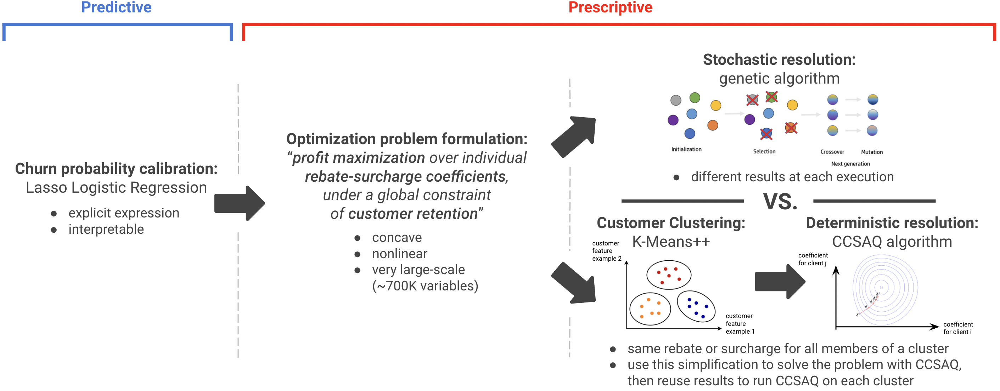

# Optimizing Insurance Renewal Prices

## :dart: Description & objective

For insurance companies to remain profitable, clients’ rates often have to be raised upon contract renewal. However, customers may choose to cancel their policy if charged excessively. This difficulty makes personalizing insurance renewal prices a complex task, and in 2020, four CentraleSupélec students and I took on the challenge of improving an insurance company’s baseline solution to this problem.

In a few words:
<p align="center">
  <a href="#"></a>
</p>


## :bulb: Methodology

The methodology followed to solve this problem can be broken down into two parts:
> - a **predictive** part, where we aim at estimating the churn probability of each client in the portfolio given individual features and the surcharge to impose
> - a **prescriptive** part, where we try to prescribe personalized surcharges to customers.

The work in this repository mainly focuses on the **prescriptive** part of the methodology. Using the churn probability estimate from the predictive part, we formulated a **profit maximization problem under a global customer retention constraint**. Its nonlinear objective function and large number of variables –the individual rebate/surcharge coefficients– impeded us from applying efficient deterministic solvers straightaway.

To overcome this issue, we compared **two approaches**. The first one used a **stochastic metaheuristic algorithm** to solve the optimization problem as-is. The second one preliminarily **clustered customers**, then solved a simplified version of the problem using a **deterministic solver** –a version that assigned the same variable to all members of a cluster. Finally, to compute truly personalized rebate/surcharge coefficients, we re-ran the deterministic solver on each cluster, initializing it with our previously found results.

The graph below summarizes the entire methodology:
<p align="center">
  <a href="#"></a>
</p>


## :file_folder: Repository organization

The repository is organized in the following way:
> - ```post_predictive_EDA.ipynb``` analyzes the characteristics of each client (revenue generated aka ```prime_profit```, cost aka ```pcc```, logistic regression coefficients,...)
> - ```prescriptive_stochastic_metaheuristic.ipynb``` implements the stochastic metaheuristic algorithm to solve the optimization problem
> - ```prescriptive_deterministic_divide&conquer.ipynb``` implements the deterministic divide & conquer approach (clustering, simplified resolution, then re-optimization).


## :wrench:	Techs used

All the code was written in ```Python3``` :snake: (Jupyter notebooks):
> - data wrangling was done using ```Pandas```
> - simple visualizations were done with ```matplotlib```
> - clustering was done using the Mini-Batch K-Means++ implementation from ```Scikit-Learn```
> - the metaheuristic algorithm (evolutionary/genetic algorithm) was implemented using ```DEAP```
> - the deterministic solver used (CCSAQ) came from ```Nlopt```.


## :family_man_woman_girl_boy: Credits

Thanks to:
> - Benjamin Fouquet
> - Charles Guibert
> - Pierre-Vincent Reungoat
> - Valentin Bailly

for your contribution on this project!


## :warning: Disclaimer

For confidentiality purposes and file size considerations, the client portfolio cannot be shared. However, the outputs from the notebooks are here to give more insights about the data!
